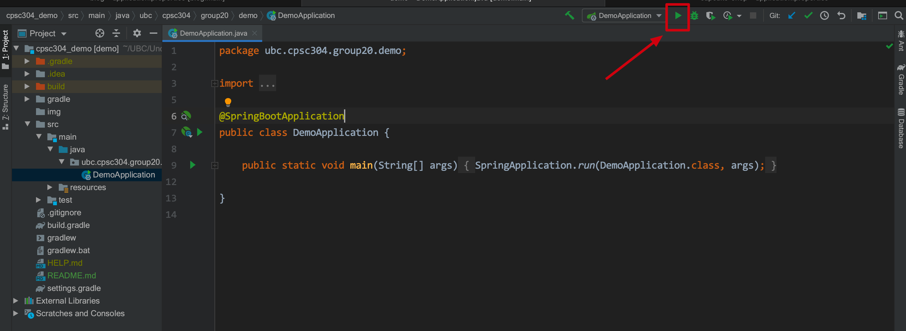
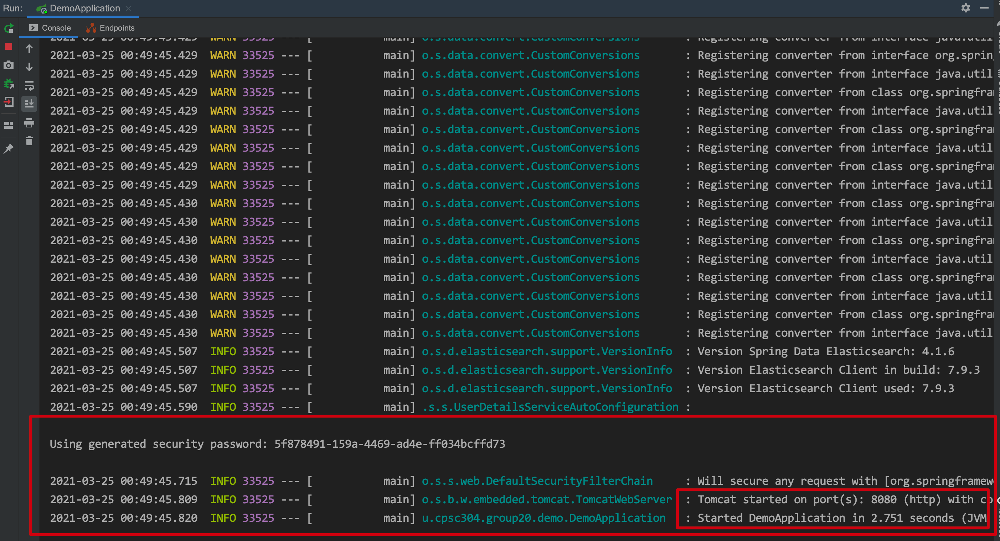

# Demo for CPSC 304 Project

## 如何打开这个Project
- 用你们自己的Github账号(不是学校的)
- `git clone https://github.com/JohnLi1999/cpsc304_demo.git`

## 配置数据库
- 在MySQL WorkBench里手动创建一个`cpsc304_demo`数据库
- 或者复制然后运行下面这个SQL
    - `CREATE DATABASE cpsc304_demo`

## 如何运行这个Project
- 用intellij IDEA打开项目，点击运行键(下面图上的绿色按钮)
    
- 或者用command line
-   ```
    cd cpsc304_demo
    ./gradlew bootRun
    ```
      
## 运行成功会显示
